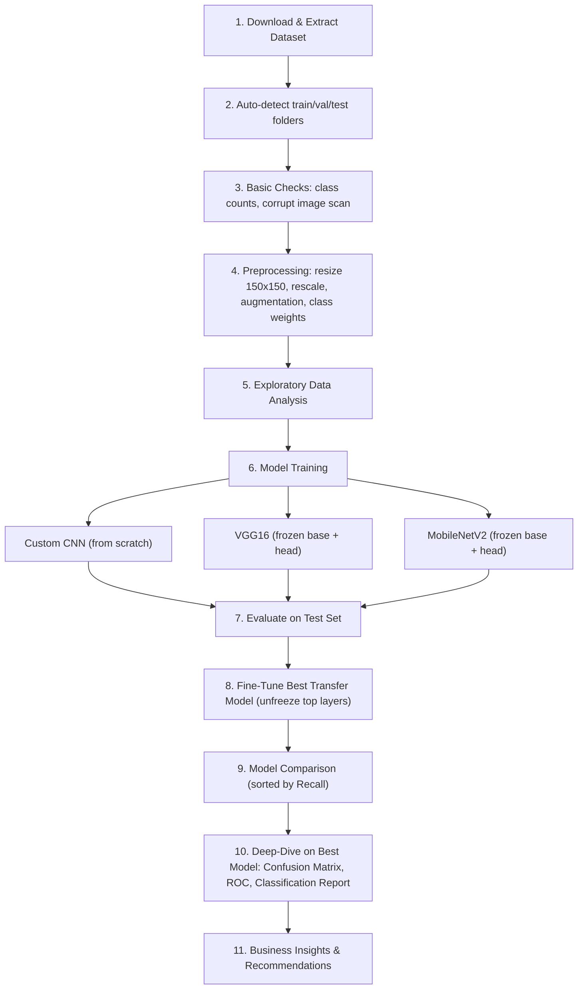

# 🫁 PRAICP-1012 — Pneumonia Chest X-Ray Classification

[](https://www.python.org/)
[](https://www.tensorflow.org/)
[](https://keras.io/)
[](https://scikit-learn.org/)
[](#-license)
[](#)

> A deep learning pipeline that classifies pediatric chest X-ray images as **NORMAL** or **PNEUMONIA**, comparing a CNN built from scratch against transfer-learning models (**VGG16**, **MobileNetV2**), with class-imbalance handling, fine-tuning, and clinically-aware evaluation (Recall-first).

---

## 📑 Table of Contents

- [Project Overview](#-project-overview)
- [Business Case](#-business-case)
- [Dataset](#-dataset)
- [Repository Structure](#-repository-structure)
- [Methodology / Pipeline](#-methodology--pipeline)
- [Model Architectures](#-model-architectures)
- [Evaluation Metrics](#-evaluation-metrics)
- [Getting Started](#-getting-started)
- [Usage](#-usage)
- [Results](#-results)
- [Key Insights](#-key-insights)
- [Challenges & Solutions](#-challenges--solutions)
- [Limitations & Disclaimer](#-limitations--disclaimer)
- [Future Work](#-future-work)
- [Tech Stack](#-tech-stack)
- [Project Links](#-project-links)
- [License](#-license)

---

## 🩺 Project Overview

| | |
|---|---|
| **Project Title** | PRAICP-1012: Pneumonia Chest X-Ray Classification |
| **Project Type** | Artificial Intelligence Capstone Project |
| **Domain** | Healthcare / Medical Imaging |
| **Task** | Binary Image Classification (NORMAL vs. PNEUMONIA) |
| **Core Technique** | Convolutional Neural Networks (custom + transfer learning) |
| **Primary Metric** | Recall (Sensitivity) on the PNEUMONIA class |
| **Dataset Source** | DataMites Capstone Project Dataset (Kermany/Mooney Chest X-Ray corpus) |

Pneumonia is diagnosed, in part, by a radiologist visually inspecting a chest X-ray for areas of increased opacity in the lung fields. Manual screening is time-consuming and subject to inter-observer variability. This project builds an automated, CNN-based triage tool that flags likely-positive X-rays for prioritized radiologist review.

## 💼 Business Case

1. **Faster preliminary screening** — an automated first-pass filter can help radiologists triage cases, especially in high-volume or resource-constrained settings.
2. **Consistency** — a trained model applies the same decision criteria to every image, reducing inter-observer variability.
3. **Cost-sensitive design** — in a medical screening context, a **false negative** (calling a sick patient "healthy") is far more costly than a **false positive**, so the entire evaluation strategy in this project is built around maximizing **Recall** on the PNEUMONIA class rather than raw accuracy.

**Project Goals**
1. Build and train a CNN model that can detect Pneumonia from chest X-ray images.
2. Compare a CNN built from scratch against transfer-learning models (VGG16 and MobileNetV2).
3. Evaluate models using metrics appropriate for a medical screening task — Accuracy, Precision, Recall, F1-Score, ROC-AUC — with emphasis on Recall.
4. Select the best-performing model and derive actionable business insights.

## 📊 Dataset

| Property | Detail |
|---|---|
| **Name** | Chest X-Ray Images (Pneumonia vs Normal) |
| **Size** | ~1.5 GB |
| **Classes** | `NORMAL`, `PNEUMONIA` |
| **Structure** | `train/`, `val/`, `test/` folders, each containing `NORMAL/` and `PNEUMONIA/` subfolders |
| **Source Link** | [Chest-Xray-2.zip](https://d3ilbtxij3aepc.cloudfront.net/projects/CNN-PROJECT-7-11/Chest-Xray-2.zip) |
| **Format** | Grayscale JPEG X-rays of varying resolution, loaded as 3-channel RGB for model compatibility |

> ⚠️ **Note:** The dataset is **not bundled** with this repository (~1.5 GB). The notebook automatically downloads and extracts it into a local `Data/` folder on first run. If you already have it locally, place it alongside the notebook (or edit `DATA_ROOT` / `ZIP_PATH`) and the download step is skipped automatically.

**Known dataset quirks handled by the notebook:**
- The publicly distributed validation split contains only ~16 images — too small to reliably monitor training. The notebook **auto-detects this** and carves out a proper validation split (10%) from the training data instead.
- The training set is **imbalanced** (more PNEUMONIA than NORMAL images) — addressed via computed class weights and image augmentation.

## 🗂 Repository Structure

```
PRAICP-1012-Pneumonia-Chest-Xray-Classification/
│
├── PRAICP-1012-Pneumonia_chest_x-ray_classification.ipynb   # Main capstone notebook (end-to-end pipeline)
├── README.md                                                  # Project documentation (this file)
├── Data/                                                      # Auto-downloaded & extracted dataset (gitignored)
│   ├── train/{NORMAL,PNEUMONIA}/
│   ├── val/{NORMAL,PNEUMONIA}/        (or auto-generated _val_split/)
│   └── test/{NORMAL,PNEUMONIA}/
├── best_custom_cnn.h5                                         # Best checkpoint — CNN from scratch
├── best_vgg16.h5                                               # Best checkpoint — VGG16 transfer learning
├── best_mobilenetv2.h5                                         # Best checkpoint — MobileNetV2 transfer learning
├── best_fine_tuned.h5                                          # Best checkpoint — fine-tuned top model
└── requirements.txt                                            # (recommended) pinned dependencies
```

## 🔬 Methodology / Pipeline

The notebook is organized into a linear, reproducible pipeline:



**Preprocessing details**
- All images resized to **150×150×3**.
- Pixel values rescaled to **[0, 1]**.
- Training-only augmentation: rotation (±10°), width/height shift (10%), shear (10%), zoom (15%), horizontal flip.
- Validation/test generators use rescaling **only** — no augmentation — to keep evaluation fair.
- Class weights computed via `sklearn.utils.class_weight.compute_class_weight('balanced', ...)` and passed to every `model.fit()` call.

## 🧠 Model Architectures

### 1. Custom CNN (from scratch)
A 4-block convolutional network trained end-to-end on this dataset only:

```
Conv2D(32) → BatchNorm → MaxPool
Conv2D(64) → BatchNorm → MaxPool
Conv2D(128) → BatchNorm → MaxPool
Conv2D(128) → BatchNorm → MaxPool
Flatten → Dense(256, relu) → Dropout(0.5) → Dense(1, sigmoid)
```
Optimizer: `Adam(lr=1e-4)` · Loss: `binary_crossentropy` · Metrics: `accuracy`, `AUC`

### 2. Transfer Learning — VGG16
ImageNet-pretrained VGG16 convolutional base (frozen) + custom classification head:
```
VGG16(frozen) → GlobalAveragePooling2D → Dense(128, relu) → Dropout(0.4) → Dense(1, sigmoid)
```

### 3. Transfer Learning — MobileNetV2
Lightweight, ImageNet-pretrained MobileNetV2 base (frozen) + the same classification head design — chosen as a faster, edge-friendly alternative to VGG16.

### 4. Fine-Tuned Model
The **best-performing frozen transfer model** (selected by test ROC-AUC) is fine-tuned further:
- Top **30 layers** of the pretrained base are unfrozen.
- Recompiled with a much smaller learning rate (`1e-5`).
- Retrained for a few additional epochs, letting pretrained filters adapt to chest X-ray textures.

**Shared training safeguards (all models):**
- `EarlyStopping` on `val_loss` (patience 3–4, restores best weights)
- `ReduceLROnPlateau` on `val_loss` (halves LR on plateau)
- `ModelCheckpoint` saving the best weights (`.h5`) for each model

## 📐 Evaluation Metrics

Every model is scored on the **held-out test set** using:

| Metric | Why it matters here |
|---|---|
| **Accuracy** | Overall correctness — but misleading under class imbalance |
| **Precision** | Of predicted PNEUMONIA cases, how many are correct |
| **Recall (Sensitivity)** ⭐ | Of actual PNEUMONIA cases, how many were caught — **the primary ranking metric**, since missed cases (false negatives) are clinically dangerous |
| **F1-Score** | Harmonic balance of precision and recall |
| **ROC-AUC** | Overall discriminative ability across thresholds |

The final model comparison table is **explicitly sorted by Recall**, not accuracy — a deliberate, clinically-motivated design choice. The deployment decision threshold (default 0.5) can be lowered to trade precision for even higher recall if a hospital's risk tolerance demands it.

## 🚀 Getting Started

### Prerequisites
- Python 3.9+
- ~2 GB free disk space (dataset + checkpoints)
- GPU strongly recommended (Colab/Kaggle GPU runtime works well) — training on CPU is possible but slow

### Installation

```bash
# 1. Clone the repository
git clone https://github.com/your-username/PRAICP-1012-Pneumonia-Chest-Xray-Classification.git
cd PRAICP-1012-Pneumonia-Chest-Xray-Classification

# 2. Create and activate a virtual environment
python -m venv venv
source venv/bin/activate      # Windows: venv\Scripts\activate

# 3. Install dependencies
pip install -r requirements.txt
```

**`requirements.txt`** (recommended pins):
```
tensorflow>=2.12
numpy
pandas
matplotlib
seaborn
pillow
requests
scikit-learn
jupyter
```

## ▶️ Usage

1. Launch Jupyter and open the notebook:
   ```bash
   jupyter notebook PRAICP-1012-Pneumonia_chest_x-ray_classification.ipynb
   ```
2. **Run all cells top to bottom.** The pipeline is fully automated:
   - Section 3 downloads and extracts the dataset (skipped if `Data/` already exists).
   - Sections 4–7 perform checks, preprocessing, and EDA.
   - Section 8 trains all three models.
   - Section 9 fine-tunes the best transfer-learning model.
   - Sections 10–11 compare all models and deep-dive into the best one.
   - Section 12 summarizes business insights.
3. **To reuse a trained model** for inference elsewhere:
   ```python
   from tensorflow.keras.models import load_model
   model = load_model('best_fine_tuned.h5')

   # preprocess a new image to (1, 150, 150, 3), rescaled to [0,1], then:
   prob = model.predict(image_array)[0][0]
   label = 'PNEUMONIA' if prob >= 0.5 else 'NORMAL'
   ```

> 💡 Adjust `IMG_SIZE`, `BATCH_SIZE`, `EPOCHS`, and `FINE_TUNE_AT` (number of unfrozen layers) near the top of the relevant sections to experiment further.


## 💡 Key Insights

1. **Screening assistance, not replacement** — the model is designed as a fast, automated first-pass tool to prioritize radiologist review, not to replace clinical diagnosis.
2. **Transfer learning is data-efficient** — VGG16/MobileNetV2 reach strong performance faster than a from-scratch CNN, since ImageNet-pretrained filters transfer well to medical imaging.
3. **Recall over accuracy for triage** — models are ranked by Recall because a missed Pneumonia case is more dangerous than a false alarm; the decision threshold can be tuned lower to further favor sensitivity.
4. **Deployment trade-off** — MobileNetV2 is smaller and faster than VGG16, making it attractive for edge/low-resource deployment if its Recall is competitive.

## 🧩 Challenges & Solutions

| Challenge | Solution |
|---|---|
| Dataset too large (~1.5 GB) to load into memory | Used `flow_from_directory` generators to stream batches from disk |
| Class imbalance (more PNEUMONIA than NORMAL) | `compute_class_weight('balanced')` passed into every `fit()` call, plus training-time augmentation |
| Original validation split too small (~16 images) | Auto-detects this and carves a 10% validation split out of the training set |
| Risk of overfitting on a comparatively small, domain-specific dataset | Combined data augmentation, Dropout, BatchNormalization, and EarlyStopping |

## ⚠️ Limitations & Disclaimer

- This model is trained on a **specific, publicly-sourced pediatric chest X-ray dataset** and has **not** undergone clinical validation.
- It is intended purely as an **educational / capstone project** demonstrating an ML pipeline for medical image classification.
- **This is not a certified diagnostic tool.** Any real-world deployment would require regulatory clearance, a much larger and more diverse dataset, prospective clinical validation, and oversight by qualified radiologists.

## 🔭 Future Work

- Expand to **multi-class** classification (e.g., bacterial vs. viral pneumonia).
- Apply **Grad-CAM / saliency maps** for model explainability — a critical requirement in clinical ML.
- Evaluate on **external, out-of-distribution** X-ray datasets to test generalization.
- Explore **ensemble methods** across the custom CNN and transfer-learning models.
- Package the best model behind a lightweight inference API (e.g., FastAPI) for demo deployment.

## 🛠 Tech Stack

| Category | Tools |
|---|---|
| Language | Python |
| Deep Learning | TensorFlow, Keras |
| Pretrained Models | VGG16, MobileNetV2 (ImageNet weights) |
| Data Handling | NumPy, Pandas, Pillow |
| Visualization | Matplotlib, Seaborn |
| Evaluation | Scikit-learn |
| Environment | Jupyter Notebook |

## 🔗 Project Links

- **GitHub Repository:** `https://github.com/sameekshagithub/PRAICP-1012-Pneumonia-Chest-Xray-Classification.git`


## 📄 License

This project is released under the [MIT License](LICENSE) — free to use, modify, and distribute for educational purposes.

---

<div align="center">

**PRAICP-1012** · Artificial Intelligence Capstone Project · Chest X-Ray Pneumonia Classification

</div>
